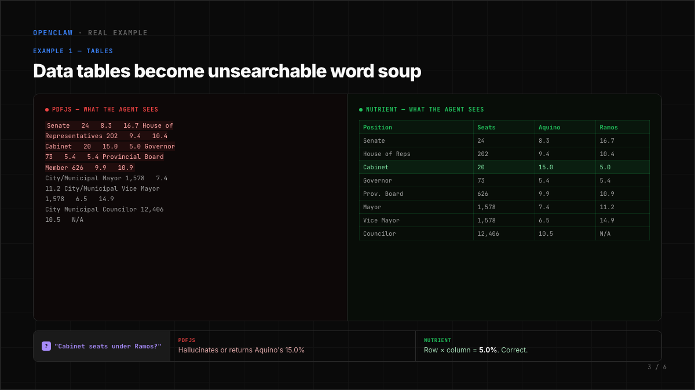
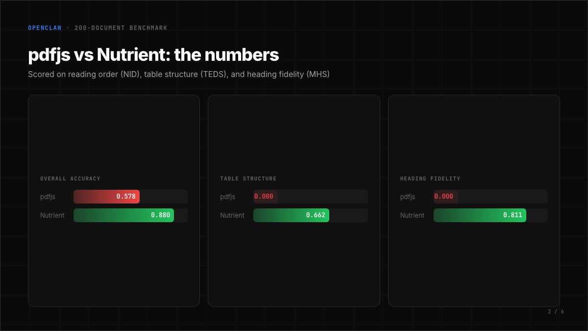

# Nutrient PDF Plugin for OpenClaw

Nutrient-powered PDF extraction that replaces the default pdfjs text extractor with structured Markdown output -- tables, headings, and reading order preserved.



## Why

OpenClaw's default PDF extractor (pdfjs) produces plain text. It scores **0.000** on table structure and **0.000** on heading preservation across 200 real documents.

When an agent asks "what's in row 3, column 4?" it is parsing word soup. Nutrient produces structured Markdown with proper table rows and columns that agents can look up directly.



## Benchmark (200 documents, opendataloader-bench)

| Metric            | pdfjs   | Nutrient | Change  |
|-------------------|---------|----------|---------|
| Overall accuracy  | 0.578   | 0.880    | **+52%**|
| Table structure   | 0.000   | 0.662    | --      |
| Heading fidelity  | 0.000   | 0.811    | --      |
| Reading order     | 0.871   | 0.924    | +6%     |

Scored with NID (reading order), TEDS (table structure), and MHS (heading fidelity).

## Install

```bash
openclaw plugin install @nutrient-sdk/openclaw-nutrient-pdf
openclaw config set agents.defaults.pdfExtraction.engine auto
```

The first command installs the plugin. The second tells OpenClaw to use Nutrient for PDF extraction with automatic pdfjs fallback.

Verify:

```bash
openclaw nutrient-pdf status
```

## What it does

- The existing `pdf` tool automatically uses Nutrient when the engine is set to `auto`
- `nutrient_pdf_extract` tool is available for agents to explicitly request Nutrient extraction
- `openclaw nutrient-pdf extract <file.pdf>` extracts a PDF from the command line
- Falls back to pdfjs if the Nutrient CLI is not installed or fails

All processing runs locally. No cloud uploads, no API keys.

## Configuration

Optional settings in your OpenClaw config:

```json5
{
  plugins: {
    entries: {
      "nutrient-pdf": {
        config: {
          command: "pdf-to-markdown",  // path to CLI binary
          timeoutMs: 30000,            // extraction timeout per document
        }
      }
    }
  }
}
```

## Free tier

The `pdf-to-markdown` CLI includes 1,000 free documents per month. See [nutrient.io](https://nutrient.io) for higher-volume licensing.

## Links

- [GitHub](https://github.com/PSPDFKit-labs/openclaw-nutrient-pdf)
- [OpenClaw PR](https://github.com/openclaw/openclaw/pull/61580)
- [Nutrient pdf-to-markdown](https://github.com/pspdfkit/pdf-to-markdown)

## License

MIT
